<div align="center">

# AI Hotel Intelligence Platform

**A property-management system and its analytics layer, in one codebase.**

FastAPI over a constrained PostgreSQL schema · a React dashboard · a deterministic statistical
intelligence layer for forecasting, anomaly detection and demand trend · and, beside it, one
offline-fitted demand model served behind a hotel-scoped endpoint, with its predictions persisted
and readable.

[](https://github.com/geortsam/AI_Hotel_Intelligence_Platform/actions/workflows/ci.yml)


</div>

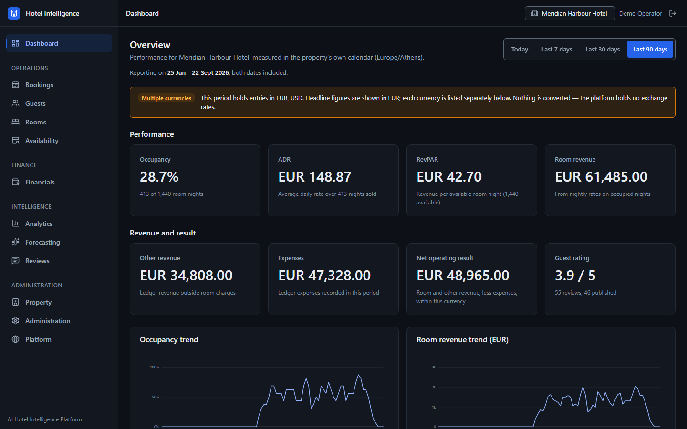

<div align="center"><sub>The overview screen. Every figure is computed server-side and labelled
with the window it covers; the multi-currency banner appears because the period holds entries in
more than one currency and the platform never converts between them.</sub></div>

> ### Current state: **V1 complete and verified**
>
> Eleven domains over a 23-table PostgreSQL 18.6 schema — hotels, room types, rooms, amenities,
> guests, bookings, payments, reviews, the financial ledger, analytics and intelligence, plus the
> stored demand predictions the served model writes and the measurements taken over them —
> reachable as **55 API paths / 87 operations**, of which **82 require authentication**.
> Authentication is Argon2id plus HS256
> access tokens; authorization is a four-level hotel role hierarchy with a separate
> platform-administrator capability. There is a complete React front end — all twelve
> navigation areas, the last of them built in Stage 7.2 — an append-only audit
> trail with verified archival, and a TLS-terminated Docker Compose deployment whose topology,
> backup/restore and image reproducibility are exercised on real containers by CI on every push.
>
> **5765 backend tests and 1141 frontend tests pass in CI.** Schema head is
> `0013_llm_invocations` across 13 linear migrations.
>
> **Two intelligence layers, deliberately kept apart.** The V1 layer is a transparent statistical
> baseline — seasonal-naive day-of-week median forecasting, MAD-based intervals and anomaly
> detection, and split-window trend detection, implemented in the Python standard library.
> Stages 6.1–6.11 added a second one: a scikit-learn demand model fitted offline, packaged into
> the API image, and **served** behind one authenticated hotel-scoped endpoint, with every served
> prediction persisted and three readers over those rows, all three now reachable over HTTP.
>
> **Implemented is not the same as scientifically validated, and this repository never conflates
> the two.** The served model is implemented and exercised by tests. Its production accuracy is
> **not** established, its reliability is **not** established, its generalisation is **not**
> established, and it is not claimed to be better than the statistical baseline or to deliver
> business value. There is no drift detection, no threshold, no alerting and no retraining. A
> passing test proves software behaviour under a declared protocol, not predictive validity —
> [docs/ml-model-card.md](docs/ml-model-card.md) §15 carries those answers as data.
>
> **No language model is ever called, and there are no embeddings, no vector database, no RAG
> and no agent framework in this repository.** Stage 7.5 added the *boundary* one would pass
> through — a `ChatModel` protocol, one provider adapter, versioned prompts and a failure
> taxonomy — and nothing on top of it: no endpoint, no tool, no copilot. The provider SDK is an
> optional dependency that neither CI nor the image installs, the feature is off by default,
> and no service or router imports the package at all. Nothing here is a placeholder pretending
> to be a feature —
> [docs/development-roadmap.md](docs/development-roadmap.md) separates what exists from what is
> left for V2, and [Known limitations](#known-limitations) is the honest list.

---

## Table of contents

1. [Screenshots](#screenshots)
2. [Project description](#project-description)
3. [Objectives](#objectives)
4. [Architecture](#architecture)
5. [Technologies](#technologies)
6. [Project structure](#project-structure)
7. [Development stages](#development-stages)
8. [How to run](#how-to-run)
9. [First run](#first-run)
10. [Testing and quality checks](#testing-and-quality-checks)
11. [Environment variables](#environment-variables)
12. [What the intelligence layer is, and is not](#what-the-intelligence-layer-is-and-is-not)
13. [Known limitations](#known-limitations)

---

## Screenshots

Captured from the running application — the real React build against the real API against real
PostgreSQL — on the demo dataset: two properties, 166 bookings, 16 rooms, 55 reviews and a
populated financial ledger. No mock-ups, and no data invented for the picture.

### Bookings

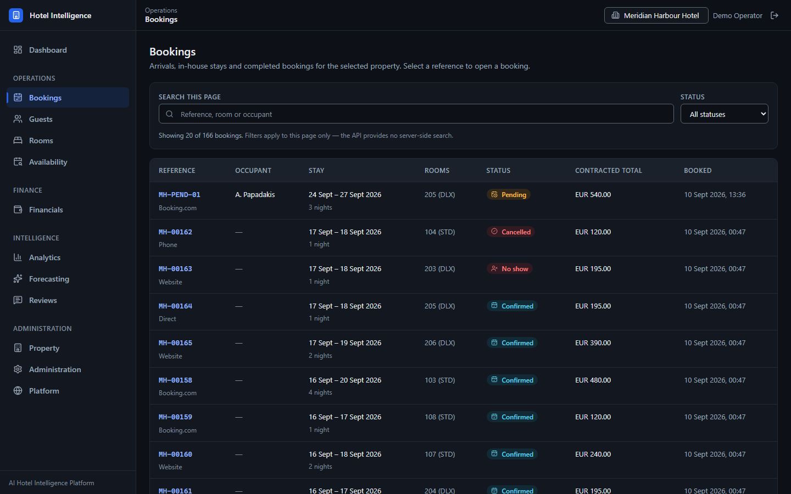

Arrivals, in-house stays and completed bookings, each with the channel it came from and its
current status. The page states plainly that its filters are client-side, because the API has no
server-side search to back them.

### Availability

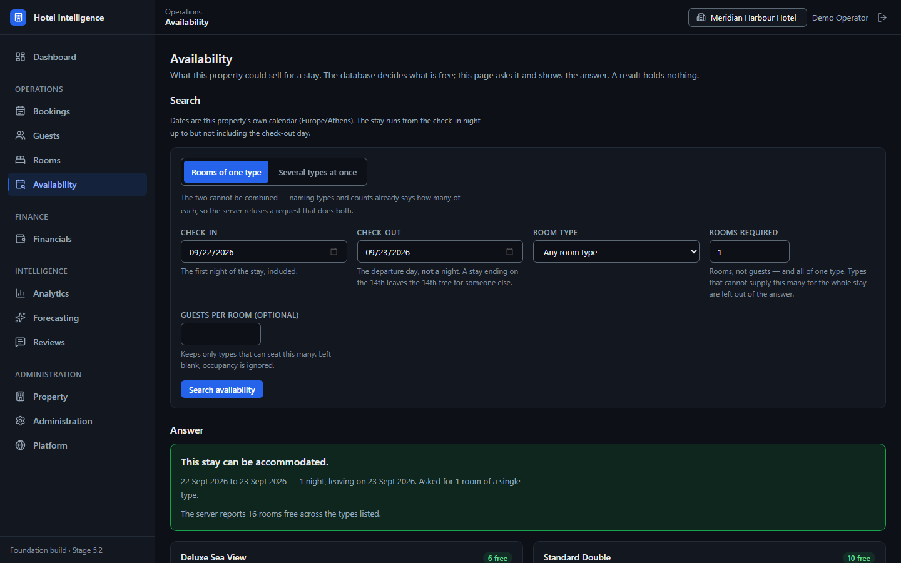

What the property could sell for a given stay. The answer comes from the database — a GiST
exclusion constraint over half-open date ranges is what makes an overlapping allocation
impossible — and the screen holds no state of its own.

### Financials

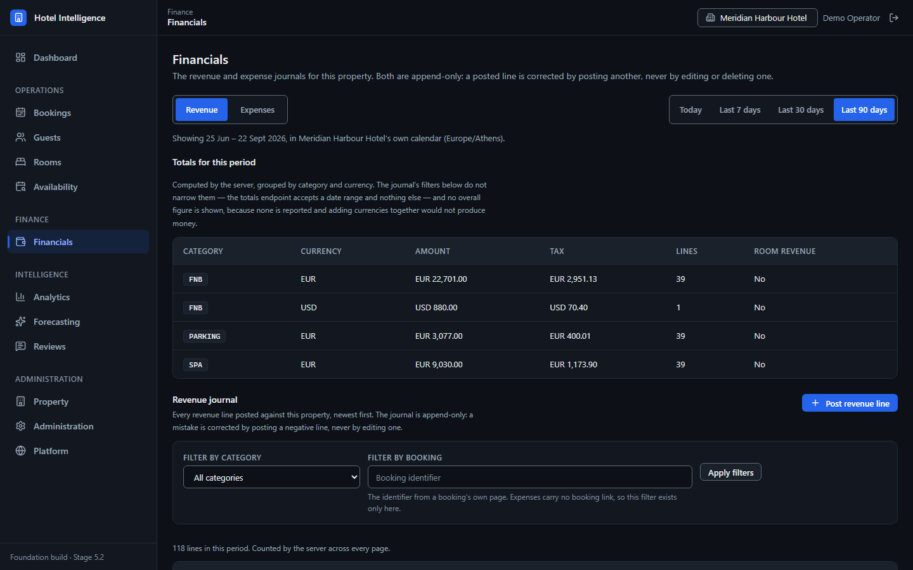

Revenue and expense journals, both append-only: a posted line is corrected by posting another,
never by editing or deleting one. Totals are grouped by category **and currency**, and no overall
figure is shown, because adding currencies together would not produce money.

### Forecasting and demand trend

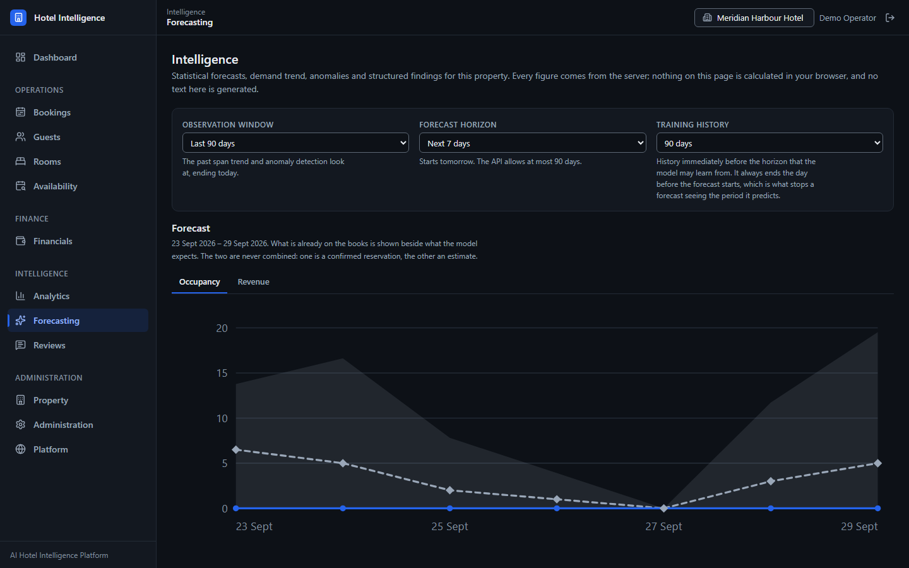

The deterministic statistical layer: seasonal-naive day-of-week median forecasting with MAD-based
intervals, demand trend and anomaly detection. What is already booked is shown *beside* what the
method expects, never blended into it — and the screen says, in those words, that nothing on it is
generated text.

### Reviews

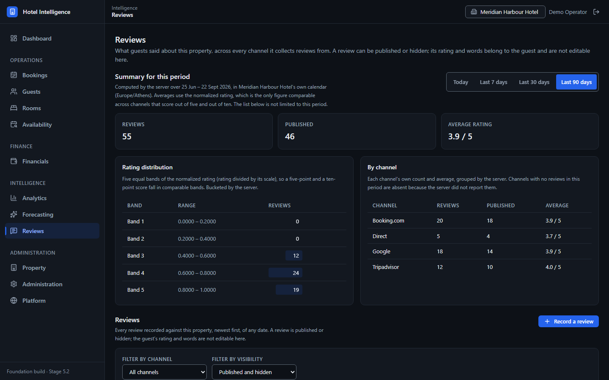

Guest reviews across every channel the property collects them from, normalized so a five-point and
a ten-point score fall in comparable bands. Ratings and review text are the guest's and are not
editable here.

<details>
<summary><b>More screens</b> — guests, rooms, property, membership administration, platform catalogues</summary>

**Guests** — the people on file at a property, with their preferences and marketing consent.
A guest record belongs to one property; the same person at another property is a separate record.

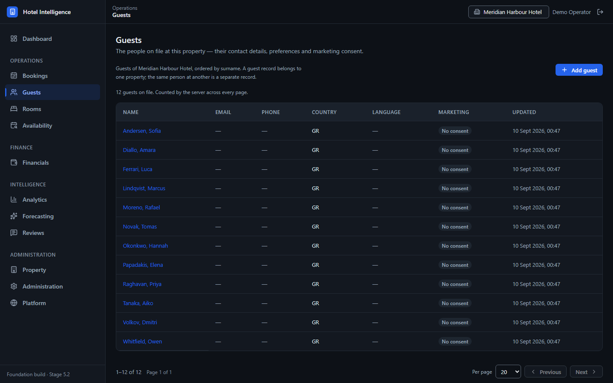

**Rooms** — physical rooms per type, with operational status kept distinct from availability.

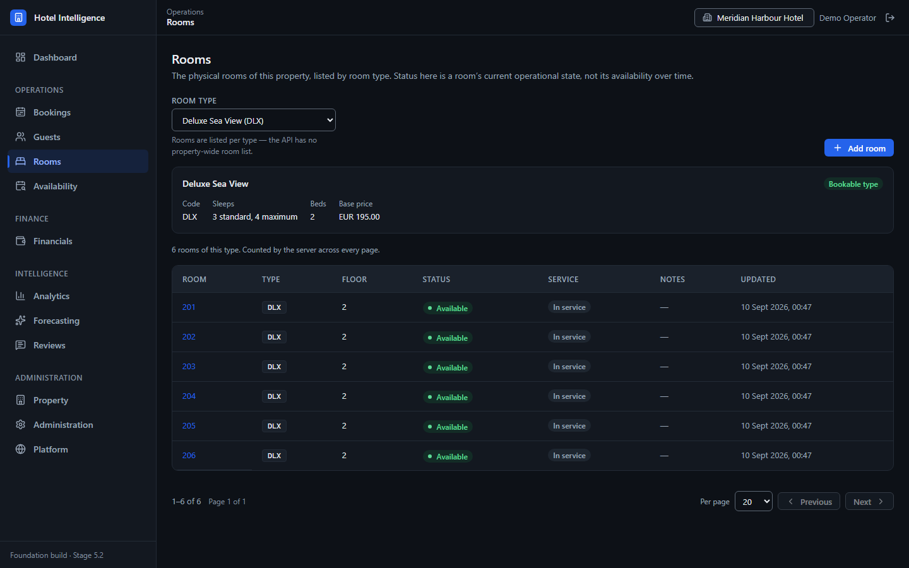

**Property** — the property record, its room types and their rates and amenities.

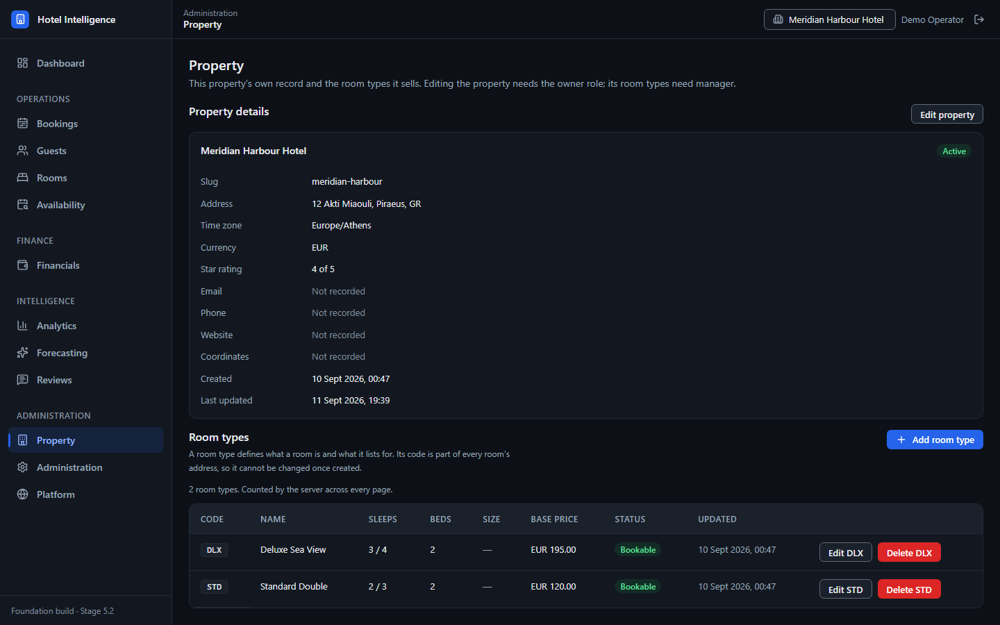

**Administration** — your own account, and who may reach the selected property. Seeing the
member list needs the manager role; changing it needs owner.

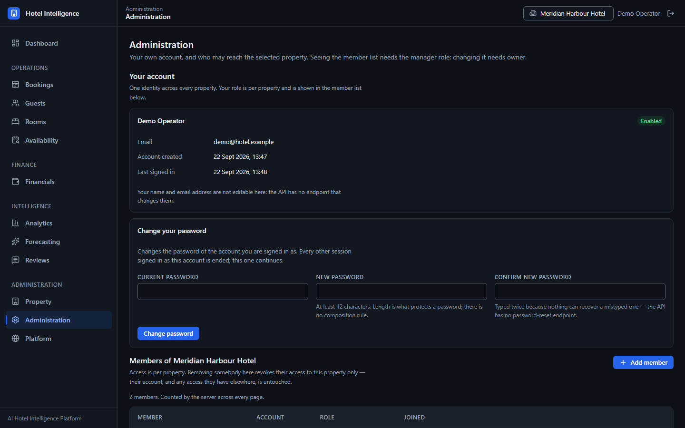

**Platform** — the catalogues every property shares, governed by a separate platform-admin
capability rather than by a hotel role.

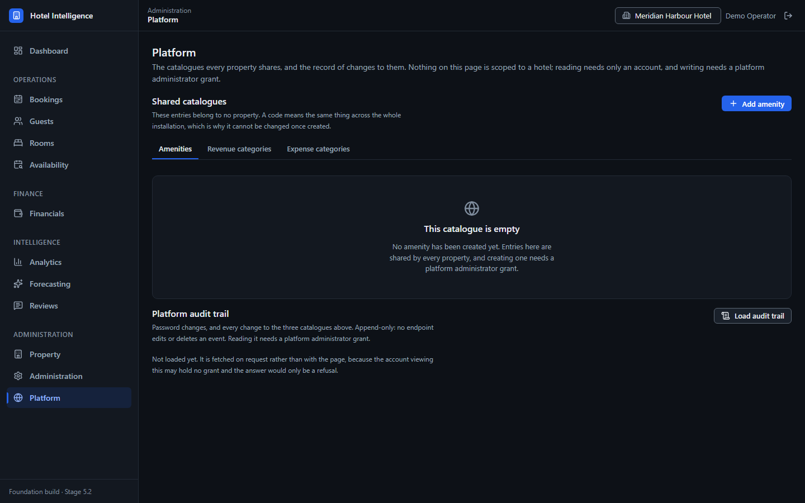

</details>

### Analytics

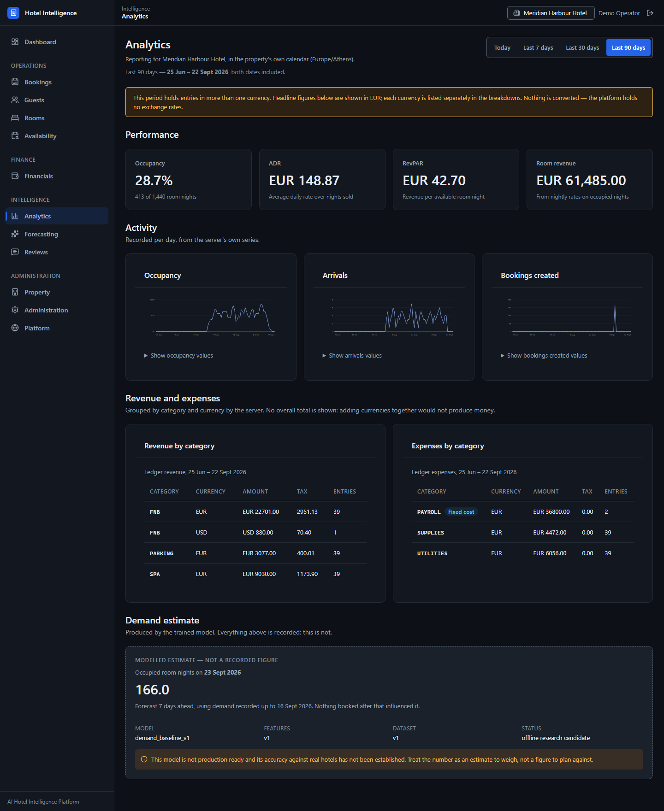

Period reporting, and the only screen that asks the **trained** demand model anything. Occupancy,
ADR and RevPAR over a chosen window; revenue and expenses grouped by category and currency with no
total row, because adding currencies together would not produce money; and — fenced off in its own
panel, labelled *modelled estimate*, carrying the model's version and its own
`production_ready: false` — one forecast. No confidence band is drawn, because the served model is
a point forecaster and a band would be invented.

---

## Project description

Hotels sit on data they rarely use: reviews nobody reads in aggregate, booking history nobody
projects forward, and photo libraries nobody organises. This platform is intended to be the
operational system *and* the analytics layer on top of it — a property-management core
(hotels, rooms, bookings, reviews) with AI modules that read that same data and feed a
dashboard.

The engineering emphasis is on the parts usually skipped in ML portfolio projects: layer
separation, a real relational schema with constraints, object-scoped authorization,
migrations, a uniform error contract, and a strict boundary between offline training and
online inference.

## Objectives

1. **Operational core** — manage hotels, rooms, bookings and reviews through a typed, versioned
   REST API backed by a properly constrained relational schema.
2. **Analytics on the same data** — sentiment, forecasting, image classification and
   recommendations reading the operational tables rather than a parallel dataset.
3. **Honest ML** — every reported metric traceable to a real evaluation run; a missing model
   fails loudly instead of inventing a prediction.
4. **Production posture** — environment-driven configuration, containerised deployment,
   migrations, tests and type checking from the first stage rather than retrofitted.
5. **Incremental delivery** — seven stages, each verified before the next begins.

## Architecture

### The deployed system

One host, four services, and exactly one of them published. Every arrow below is exercised on
real containers by CI on every push.

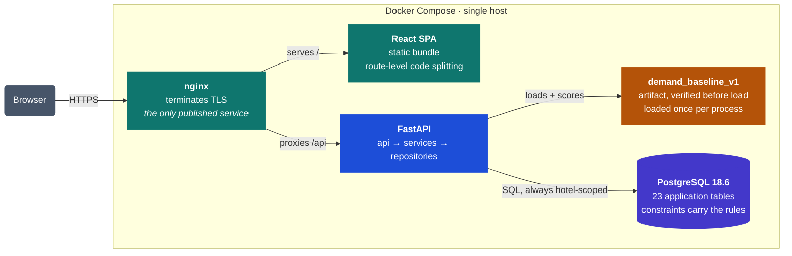

### Inside the backend

Calls travel one way. An endpoint knows HTTP but no business rules; a service knows the domain
but no SQL; a repository knows SQL but decides nothing. Each rule is asserted by the architecture
suite, not merely intended.

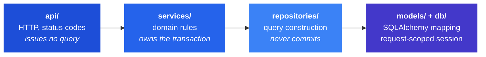

### The offline / online boundary

Training is offline and stays offline. What crosses into the running system is a **verified
artifact and the code that reads it** — never a pipeline that fits one.

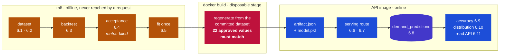

The backend imports the offline package's *reading* half — `ml.artifact` and `ml.inference`,
deferred to load time by `app.ml.artifact_store` — so the serving path can verify and score an
artifact. The pipelines that **fit** a model do not cross that line and are not copied into the
API image; two tests assert exactly which modules are.

Full detail, including the rules later stages must follow:
**[docs/architecture.md](docs/architecture.md)**.

## Technologies

| Area | Choice | Role |
|---|---|---|
| Backend | Python 3.14, FastAPI, Uvicorn | Async HTTP API, OpenAPI generated from types |
| Validation | Pydantic v2, pydantic-settings | Request/response schemas, environment config |
| ORM | SQLAlchemy 2.0 | Data mapping across 15 model modules |
| Database | PostgreSQL 18.6 | System of record. No SQLite fallback — the schema needs exclusion constraints, deferred triggers and generated columns |
| Migrations | Alembic | 13 linear revisions, head `0013_llm_invocations` |
| Auth | argon2-cffi, PyJWT | Argon2id hashing, HS256 access tokens |
| Frontend | React 18, TypeScript 5.7, Vite 6 | Dashboard SPA, route-level code splitting |
| Intelligence (V1) | Python standard library | Deterministic statistical baseline — no NumPy or pandas on its path |
| Demand model (Stage 6.1–6.11) | scikit-learn 1.9.1 | One offline-fitted artifact, packaged into the API image and served behind one hotel-scoped endpoint |
| Infrastructure | Docker, Docker Compose, nginx | Single-host stack; nginx terminates TLS and is the only published service |
| Quality | pytest, ruff, mypy, Vitest | Tests, linting, static types |

`pyproject.toml` declares `requires-python = ">=3.12"` as the supported floor, and ruff and mypy
target `py312` so the gates reject anything that would break it. What actually runs — in CI and
in the API image — is **3.14.7**.

`ml/requirements-ml.txt` pins **scikit-learn** for the offline work in `ml/`, and since Stage
6.7 `backend/requirements.txt` pins the same version — `1.9.1` — so the model is served by the
library it was fitted with rather than a nearby one. The API image therefore carries scikit-learn,
thirteen `ml/` modules (the import closure of `ml.artifact` and `ml.inference`) and the regenerated
artifact; it carries **no dataset, no notebook, no manifest, no test directory and no pipeline that
fits a model**, and CI asserts each of those against the built image. No module under `backend/app`
imports scikit-learn directly: `app.ml.artifact_store` defers the `ml.artifact` import to load time
so that a runtime without it answers a served 503 rather than failing to start.

## Project structure

Five areas at the top level, with one-way dependencies between them.

| Area | What lives there | Reaches |
|---|---|---|
| **`backend/`** | The FastAPI application and its Dockerfile | `database/`, and `ml/`'s reading half |
| **`frontend/`** | React + TypeScript SPA and its nginx production image | the API over HTTP, nothing else |
| **`database/`** | 11 linear Alembic revisions and the init SQL | — |
| **`ml/`** | Offline dataset, backtest, acceptance, artifact. Records committed, payloads never | `app.ml.dataset` only — the Stage 6.1 contract |
| **`docs/`** | Architecture, roadmap, design records, model card, deployment runbooks | — |

```
backend/app/
├── api/            29  HTTP layer: v1 routers, dependency wiring
├── services/       28  domain rules, transaction boundaries
├── schemas/        24  Pydantic request and response types
├── repositories/   20  query construction — no commits, ever
├── models/         15  SQLAlchemy ORM mapping
├── ml/              9  statistical layer, artifact store, serving,
│                       accuracy and distribution protocols
├── core/            9  config, errors, security, logging
├── db/              3  engine and request-scoped session
├── middleware/      3  request id, security headers
└── main.py             app factory

tests/              backend/ and integration/, mirroring the source layout
pyproject.toml      ruff · mypy · pytest · coverage
docker-compose.yml  db → migrate → api → frontend, each gated on the last
```

**Where to look first**, depending on what you came for:

| If you want to see… | Read |
|---|---|
| How a request becomes a row | [`docs/architecture.md`](docs/architecture.md) §2 and §4 |
| Why the schema is shaped this way | [`docs/database-design.md`](docs/database-design.md) |
| What the model is, and is not | [`docs/ml-model-card.md`](docs/ml-model-card.md) |
| How the model reaches production | [`docs/ml-production-runtime.md`](docs/ml-production-runtime.md) |
| What was built, stage by stage | [`docs/development-roadmap.md`](docs/development-roadmap.md) |

## Development stages

**V1 is complete**, and Stage 6 is V2 work delivered on top of it as stages rather than left in
the backlog. Every stage below was implemented, tested, verified and documented before the next
one began.

| Stage | Scope | Status |
|---|---|---|
| 1 | Foundation: structure, config, tooling, docs, `/health` | **done** |
| 2 | Database schema, models, migrations (2A–2C) | **done** |
| 3B.1–3B.9 | Domain API: hotels → ledger, over a frozen schema | **done** |
| 3B.10 | Analytics: KPIs, daily series, per-currency money | **done** |
| 3B.11 | Intelligence: forecasting, trend, anomalies, insights | **done** |
| 3B.12 | Cross-domain integration and backend hardening | **done** |
| 4.x | Authentication, membership authorization, platform administration, audit trail and retention, server-side pricing, availability | **done** |
| 5.1–5.16 | React front end: authentication, domain views, intelligence | **done** |
| 5.17–5.25 | Test-database safety, quality gates, CI pipeline, frontend performance | **done** |
| 5.26–5.38 | Production serving, Docker runtime, bootstrap, backup/restore, TLS, deployment robustness, image reproducibility | **done** |
| 6.1–6.11 | Demand model lifecycle: leakage-safe dataset, versioned training data, offline backtest, metric-blind acceptance, artifact, serving, packaging, prediction persistence, accuracy measurement, distribution observation, stored-prediction read API | **done** |
| 7.1–7.2 | V2 definition and the analytics reporting view: period KPIs, category breakdowns, activity charts, and the first interface to the served demand model | **done** |
| 7.3–7.4 | The frozen accuracy and distribution protocols exposed over HTTP, and made legible: forecast against actual, measured error per calibration segment, and the claim boundary on screen | **done** |

What is **not** implemented, and not claimed anywhere in this repository: review sentiment,
room-image classification, recommendations, any LLM/RAG/agent capability, drift detection,
retraining, a registry holding more than one model, and the operational items listed under
[Known limitations](#known-limitations). See
[docs/development-roadmap.md](docs/development-roadmap.md) for the split.

Detail and exit criteria: **[docs/development-roadmap.md](docs/development-roadmap.md)**.

## How to run

### Backend (verified)

From the repository root:

```bash
python -m venv .venv
```

```bash
.venv/Scripts/python.exe -m pip install -r backend/requirements.txt -r backend/requirements-dev.txt
```

On macOS or Linux use `.venv/bin/python` throughout.

Copying the environment template is optional in Stage 1 — every setting has a working default:

```bash
cp .env.example .env
```

Start the API:

```bash
.venv/Scripts/python.exe -m uvicorn app.main:app --app-dir backend --reload
```

| URL | What you get |
|---|---|
| http://localhost:8000/health | `{"status":"ok", ...}` |
| http://localhost:8000/health/db | `{"status":"ok","database":"reachable", ...}`, or 503 when it is not |
| http://localhost:8000/docs | Swagger UI — 55 paths, 87 operations. Disabled when `ENVIRONMENT=production` |

### Frontend

```bash
cd frontend && npm ci && npm run dev
```

`npm ci` rather than `npm install`: `package-lock.json` is committed, and CI installs from it.

### Docker

`POSTGRES_PASSWORD` must be set in `.env`; Compose refuses to start without it. Set `SECRET_KEY`
too if you intend `ENVIRONMENT=production` — the API refuses to start in production without one.

**The stack terminates TLS, so it needs a certificate before it will start.** For local use,
one command:

```bash
mkdir -p certs && chmod 700 certs && openssl req -x509 -newkey rsa:2048 -nodes -keyout certs/privkey.pem -out certs/fullchain.pem -days 365 -subj "/CN=localhost" -addext "subjectAltName=DNS:localhost,IP:127.0.0.1" && chmod 600 certs/privkey.pem
```

```bash
docker compose up --build
```

The stack starts in a fixed order, each step gated on the previous one succeeding:

```
db healthy  →  migrate exits 0  →  api healthy  →  frontend starts
```

`migrate` is a one-shot service running `alembic upgrade head`; the API does not start unless it
exits 0, so the schema can never be behind the code that serves it.

Browse the application at **https://localhost:8443** — nginx terminates TLS, serves the built SPA
and proxies `/api/` to the API on the same origin, so no second origin and no CORS are involved.
http://localhost:8080 exists only to redirect there. With a self-signed certificate the browser
will warn once; that is what self-signed means.

**Only nginx is published.** The API and the database have no host ports — reach them with
`docker compose exec` rather than over the network. See
[docs/deployment/tls.md](docs/deployment/tls.md) for certificates, renewal, the trusted-proxy
boundary and what this deliberately does not automate, and
[docs/deployment/robustness.md](docs/deployment/robustness.md) for which operations are safe
against a running stack — recreating the API, restarting it, running a second stack — and what
each healthcheck does and does not prove.

This flow is exercised on every push: see [Continuous integration](#continuous-integration).

## First run

A freshly migrated database is empty, and the two things a new installation needs come from
two different places.

**The first hotel needs no manual step.** Register, sign in, and create it through the API —
the creator receives the `owner` membership in the same transaction as the hotel row:

```bash
POST /api/v1/auth/register  →  POST /api/v1/auth/login  →  POST /api/v1/hotels
```

**The first platform administrator has no API, by design.** `platform_admins` governs the
catalogues every hotel shares, so the grant is a deliberate out-of-band database write rather
than something an endpoint hands out — the same grant the integration suite performs. It
requires that the intended person has already registered, and it is idempotent:

```sql
INSERT INTO platform_admins (user_id, role)
SELECT u.id, 'platform_admin' FROM users u WHERE u.email = lower('ops@example.com')
ON CONFLICT (user_id) DO NOTHING;
```

An empty database is not authorization: nothing here creates an administrator because it
noticed no rows.

**Read [docs/deployment/first-run-bootstrap.md](docs/deployment/first-run-bootstrap.md) before
running the grant** — it covers the checks to make first, how to verify the result, secret
handling, what is *not* audited, and what to do if the wrong user was granted.

## Testing and quality checks

All run from the repository root:

```bash
.venv/Scripts/python.exe -m pytest -q
```

```bash
.venv/Scripts/python.exe -m ruff check .
```

```bash
.venv/Scripts/python.exe -m mypy backend/app
```

Coverage:

```bash
.venv/Scripts/python.exe -m pytest --cov --cov-report=term-missing
```

### PostgreSQL integration tests

The integration suite is **destructive**: it runs `alembic downgrade base` and
`TRUNCATE ... RESTART IDENTITY CASCADE`. It runs only when `TEST_DATABASE_URL` is set, and
only against a database that has proved it is disposable. Without the variable those tests
skip as PENDING; the rest of the suite runs normally and needs no database.

**Never point `TEST_DATABASE_URL` at the demo database, or at any database you would miss.**
A `_test` suffix is not enough on its own — this project's CI container and its demo database
share the name `hotel_intelligence_test` — so the guard also reads the target and refuses one
that already holds application data.

Get a safe database with the helper, which creates it, marks it disposable, and will not drop
anything that has not cleared the guard:

```bash
.venv/Scripts/python.exe scripts/testdb.py create my_scratch_test
.venv/Scripts/python.exe scripts/testdb.py check  my_scratch_test
.venv/Scripts/python.exe scripts/testdb.py drop   my_scratch_test
```

Then, with `TEST_DATABASE_URL` set to that database:

```bash
.venv/Scripts/python.exe -m pytest tests/integration
```

If the target is not disposable the suite stops before any SQL runs and prints what it found,
what it refused to do, and how to proceed. See `tests/db_safety.py` and
`docs/database-implementation.md`.

Tests live at the repository root and import `app` via `pythonpath = ["backend"]` in
`pyproject.toml`.

### Continuous integration

Every push and pull request to `main` runs four jobs in parallel on `ubuntu-latest`
(`.github/workflows/ci.yml`):

| Job | What it runs |
|---|---|
| `quality-gates` | Ruff lint, Ruff format check, mypy, the Alembic chain against a disposable PostgreSQL 18.6, then the full pytest suite |
| `Frontend quality gates` | `npm ci`, the Vitest suite, both TypeScript projects, the production build |
| `Docker runtime verification` | builds both images, **runs the real Compose stack**, and **backs it up and restores it** |
| `Image reproducibility` | builds each image **twice with `--no-cache`** and requires every shipped file to be byte-identical |

The third job is the one worth knowing about. It is not a lint of the YAML: it starts the
stack in a disposable, run-scoped Compose project and asserts, among other things, that
PostgreSQL reports 18.6, that `migrate` exits 0 and leaves the schema at `0013`, that the API
and frontend both become healthy, that nginx serves the SPA at `/`, `/bookings`, `/reviews`
and `/intelligence`, that `/api/v1/` is proxied through to FastAPI while an unknown `/api/`
path still returns a real 404 rather than the SPA, that `SECRET_KEY` and `POSTGRES_PASSWORD`
reach no frontend container or served asset, that a second `alembic upgrade head` is a no-op,
that the schema survives a stop/start, and that **a deliberately broken migration prevents the
API from starting at all**.

It then replaces the API container outright and requires the **same** nginx — same container,
same master pid, never restarted — to keep serving HTTPS and to reach the replacement, with TLS,
the forwarded-proto trust chain, every security header and the exposure boundary re-asserted
afterwards; see [docs/deployment/robustness.md](docs/deployment/robustness.md). Finally it seeds
data through the real API, takes a `pg_dump`, restores it into a **separate** PostgreSQL 18.6
instance, and requires the restored database to match the source byte for byte and to serve the
application — see [docs/deployment/backup-restore.md](docs/deployment/backup-restore.md).
Everything is torn down afterwards, volumes included.

That is why the deployment files in this repository are no longer described as unverified.

## Environment variables

Every variable is documented in [`.env.example`](.env.example). Configuration is read from the
environment only — never hard-coded — so one artifact runs in every environment.

| Variable | Default | Notes |
|---|---|---|
| `ENVIRONMENT` | `development` | `development`, `test`, `staging` or `production` |
| `DEBUG` | `false` | |
| `APP_NAME` | AI Hotel Intelligence Platform | Shown in the OpenAPI title |
| `API_V1_PREFIX` | `/api/v1` | Reserved for Stage 2 |
| `LOG_LEVEL` | `INFO` | |
| `CORS_ORIGINS` | localhost:5173, localhost:3000 | Comma-separated |
| `DATABASE_URL` | *(empty)* | Declared; unused until Stage 2 |
| `SECRET_KEY` | *(empty)* | Declared; unused until authentication exists |

`.env` is git-ignored. `.env.example` contains no real secrets and never should.

In production, `/docs`, `/redoc` and `/openapi.json` are disabled automatically.

## What the intelligence layer is, and is not

**V1 — what exists.** A deterministic statistical baseline, computed on request from the
operational tables, implemented in the Python standard library and carrying
`MODEL_VERSION = "1.0.0"`:

| Capability | Method |
|---|---|
| Occupancy and revenue forecasting | seasonal-naive day-of-week median, falling back to the window median where a weekday bucket is too thin |
| Prediction intervals | median absolute deviation, scaled by 1.4826 |
| Anomaly detection | modified z-score on the MAD (Iglewicz & Hoaglin, threshold 3.5) |
| Demand trend | split-window median comparison against an explicit relative threshold |
| Insights | deterministic templates over the figures above |

The same question always returns the same answer. The forecast method is reported per point
rather than hidden, and the trend response returns both window medians and the threshold, so its
classification can be recomputed by hand.

### The trained demand model — what Stages 6.1–6.11 built

A **second** layer, beside the one above rather than replacing it. It does not feed the V1
forecasting, trend or anomaly responses, and those are unchanged by its existence. Each stage
draws its own boundary:

| Stage | What exists |
|---|---|
| 6.1 | A leakage-safe demand dataset built from the operational tables: one row per hotel per date, every feature tied to an explicit prediction cutoff, chronological splits with no shuffle parameter |
| 6.2 | A versioned training dataset from a published CC BY 4.0 hotel-booking dataset, pinned to a commit and checksum-enforced on every run |
| 6.3 | A deterministic rolling-origin backtest of a seasonal-naive baseline and one `HistGradientBoostingRegressor` over 54 chronological origins, recorded in `metrics.json`. **No winner is declared** — the per-fold spread dwarfs the difference between the two |
| 6.4 | An acceptance protocol declared in code *before* the result and structurally unable to read any metric value: PASS on 13 of 13 criteria, every one about reproducibility and identity rather than accuracy |
| 6.5 | One fitted artifact — **generated, never committed**, and loaded only after its metadata and digest have been checked, because a pickle is arbitrary code on load |
| 6.6 | One authenticated, hotel-scoped, read-only serving route. Authorization resolves the hotel first; a missing or unverifiable artifact is an explicit `503`, never a fabricated number |
| 6.7 | The artifact regenerated inside a disposable Docker build stage and verified against 22 approved values before any image may be built from it, so the image carries the model and nothing that could fit one |
| 6.8 | Every served prediction persisted as a durable, attributable row — model identity, the nine inputs, a feature digest — inside the same transaction as the response it describes |
| 6.9 | A frozen, content-checksummed protocol measuring stored predictions against realised demand after a 28-day settlement lag. Computed and returned, never persisted |
| 6.10 | A frozen protocol summarising a hotel's stored model inputs and outputs over one window and comparing them against a baseline window. Summaries and differences only |
| 6.11 | One paginated, tenant-scoped `GET` letting a hotel's own members read that hotel's stored predictions, addressed by a public UUID and exposing no internal identifier |
| 7.3 | Two tenant-scoped `GET`s exposing the 6.9 and 6.10 protocols over HTTP, unchanged. Manager role for accuracy, membership for distribution; both drop the model digest and the per-prediction digests, and both carry the "no production accuracy established" statement in the payload |
| 7.4 | The first screen for any of it: actual occupancy beside the stored predictions as two never-blended series, measured error per calibration segment with no combined figure, the settlement lag and the "not established" caveat in the panel body. Nothing on it is computed in the browser |

**What none of that establishes.** Not production accuracy, not reliability, not generalisation
beyond the two hotels the numbers came from, not superiority over the statistical baseline, and not
business value. Stage 6.9 evaluates no threshold and ranks nothing; Stage 6.10 **detects nothing** —
no threshold, no verdict, no alert, no PSI, no KS, no Jensen-Shannon; nothing retrains anything; and
returning a number endorses none of it. The model card carries those answers as data rather than as
prose: [docs/ml-model-card.md](docs/ml-model-card.md) §15.

The measured limitation to know before reading any number: the model **cannot distinguish hotels at
or below roughly forty room nights a night** — each of them receives ≈165.83 — measured in Stage 6.6
and unchanged since.

See [docs/ml-training-data.md](docs/ml-training-data.md),
[docs/ml-model-evaluation.md](docs/ml-model-evaluation.md),
[docs/ml-model-validation.md](docs/ml-model-validation.md),
[docs/ml-model-card.md](docs/ml-model-card.md), [docs/ml-serving.md](docs/ml-serving.md),
[docs/ml-production-runtime.md](docs/ml-production-runtime.md),
[docs/ml-prediction-persistence-design.md](docs/ml-prediction-persistence-design.md),
[docs/ml-accuracy-measurement.md](docs/ml-accuracy-measurement.md),
[docs/ml-drift-observation.md](docs/ml-drift-observation.md),
[docs/ml-prediction-read-api.md](docs/ml-prediction-read-api.md) and
[docs/ml-forecast-performance-api.md](docs/ml-forecast-performance-api.md).

**No language model is ever called.** Stage 7.5 added the seam one would pass through and
nothing that uses it: `app/llm/` holds a `ChatModel` protocol, one provider adapter, versioned
checksummed prompts, the six declared failure modes and four test doubles. There is no
endpoint, no tool, no copilot, no RAG, no embeddings, no vector database and no agent
framework. The provider SDK lives in `backend/requirements-llm.txt`, which neither CI nor the
Docker image installs; `llm_enabled` is false by default; and a repository-wide test asserts
the SDK is imported in exactly one module and that no service or router reaches the package.

### V2 — NOT IMPLEMENTED

None of these exists. Each would be built as its own stage, with its dependencies in
`ml/requirements-ml.txt`, its pipeline in `ml/pipelines/`, and its artifacts plus evaluation
record in `ml/models/<model_version>/` — which is where Stage 6.3 wrote the first `metrics.json`.

| Module | Input | Output |
|---|---|---|
| **Drift detection** | Stored predictions and features | A statistic, a threshold and an alert. Stage 6.10 observes distributions and deliberately decides nothing |
| **Retraining and model promotion** | A drift or accuracy signal | A second model version, a registry able to hold more than one, and a promotion decision |
| **Review sentiment** | Review text | Polarity plus an aspect breakdown (cleanliness, staff, location, value) and token-level explanations |
| **Room-image classification** | Room photographs | Room type and feature tags for automatic media organisation |
| **Recommendations** | User and hotel history | Ranked hotel suggestions, evaluated against a popularity baseline |
| **LLM / RAG / agent capability** | — | Nothing of the kind exists today; it is direction, not capability |

Rules these must follow, fixed now so they are not negotiated later:

- Training is offline and never imports the web layer; serving loads an artifact from disk.
- Predictions are persisted with the model version that produced them.
- A metric may only be quoted from a real evaluation run recorded in `metrics.json`.
- A missing artifact returns an explicit unavailable-model error — never a fabricated number.

## Known limitations

**The deployment's authority is CI, not a developer's machine.** Every push builds both images,
runs the four-service stack, migrates a real database, serves a prediction from the packaged
model and backs the whole thing up and restores it — see
[Continuous integration](#continuous-integration). That is where the claims in this README about
the deployment come from.

*This paragraph used to say the development machine had no working Docker daemon and could
build nothing locally. That was true when written and is no longer: the stack has since been
built and run end to end on the development machine, reproducing the same `22 approved values
verified` the CI build reports, and with a payload digest that differed from the recorded one —
which is the environment-scoped behaviour [docs/ml-production-runtime.md](docs/ml-production-runtime.md)
predicts and the canonical digest exists to survive.*

### Security posture

Three things are worth knowing before this is exposed to anyone real. None is a defect in the
sense of not working as designed; each is a deliberate V1 boundary, recorded here rather than
left to be discovered.

- **The access token is stored in `sessionStorage`.** The backend authenticates with a bearer
  JWT and offers no cookie session, so the token must be readable by JavaScript — which means
  **any cross-site-scripting flaw in the front end could exfiltrate it**. `sessionStorage` is
  chosen over `localStorage` only for lifetime: it is scoped to the tab and cleared when the tab
  closes, and the token lives 30 minutes. The content security policy is `script-src 'self'`
  with no inline script and no `eval`, which narrows the exposure but does not remove it. The
  real fix is an `HttpOnly; Secure; SameSite` cookie issued by the backend — a backend change,
  and V2 work. See [docs/architecture.md §7.1](docs/architecture.md#71-session-handling-and-its-limitation).
- **Registration is open, and creating a hotel makes you its owner.** `POST /auth/register` is
  unauthenticated by design, and any authenticated user may `POST /hotels` and becomes that
  hotel's `owner`. This is the documented first-run path — see [First run](#first-run) — and it
  is appropriate for a self-hosted deployment, not for a public multi-tenant service.
- **The two health probes are unauthenticated**, and `/health/db` opens a database connection.
  Neither returns business data; both are reachable only through nginx, since the API has no
  host port.

### Operational

What remains genuinely missing is operational rather than functional:

- **Backup and restore are documented and runtime-verified, but not automated.**
  [docs/deployment/backup-restore.md](docs/deployment/backup-restore.md) is the procedure, and CI
  proves it on every push: it dumps a seeded database, restores into a *separate* PostgreSQL
  18.6 instance, requires the restored data to match the source byte for byte, and requires the
  real API to serve from the result. What is **not** automated is scheduling, off-host storage,
  encryption, retention and point-in-time recovery — taking a backup remains a deliberate
  operator action. `docker compose down -v` still destroys the volume permanently.
- **TLS terminates at nginx and is runtime-verified, but certificates are not automated.** There
  is no ACME client, no certbot and no renewal timer: replacing a certificate is a file swap and
  `nginx -s reload`. CI proves the configuration with a *self-signed* certificate, which is not
  the same as being ready for public internet exposure — that also needs a real certificate and
  a real hostname. See [docs/deployment/tls.md](docs/deployment/tls.md).
- **There is no zero-downtime deployment.** A recreated API container is now picked up by the
  *running* nginx without restarting it, and CI proves that on real containers — but there is a
  window of up to ten seconds, bounded by the DNS resolver's `valid=`, in which `/api` can
  answer 502. This is a single-nginx, single-API stack: it has no second instance to route to
  meanwhile. See [docs/deployment/robustness.md](docs/deployment/robustness.md).
- **A second stack on one host still needs its own address space.** Container names, the
  network and the volume are all scoped to the Compose project, so two copies coexist — but the
  subnet is *declared* rather than discovered, so that the trust boundary can be a constant, and
  two networks cannot claim one range. `COMPOSE_SUBNET`, `FRONTEND_IP` and `TRUSTED_PROXIES`
  move together.
- **Transitive Python dependencies are not pinned.** `requirements.txt` fixes the ten direct
  packages with `==`; what *they* depend on is resolved by pip at build time, so a new release
  of `anyio` or `h11` changes the image without changing this repository. Closing that needs a
  hash-pinned lock file maintained beside `requirements.txt` — a second source of truth for
  dependencies, which is a deliberate omission rather than an oversight. Base images, the
  interpreter and the frontend tree are all pinned; see
  [docs/deployment/reproducibility.md](docs/deployment/reproducibility.md).
- **Nothing updates the pins.** No Renovate, no Dependabot. A pinned digest is a digest that
  goes stale, and sitting on a base image with a known CVE is the real cost of pinning; bumping
  one is a deliberate act.
- **No platform-administrator API.** Granting platform administration is a deliberate
  out-of-band database write; see [First run](#first-run). That is by design, not an omission.

The V1 intelligence layer remains a transparent statistical baseline. The trained demand model
sits beside it — served, but **not scientifically validated**, and with no front-end surface — as
described under
[What the intelligence layer is, and is not](#what-the-intelligence-layer-is-and-is-not).
